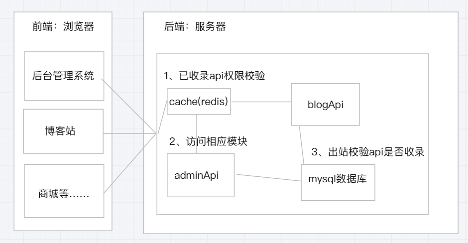
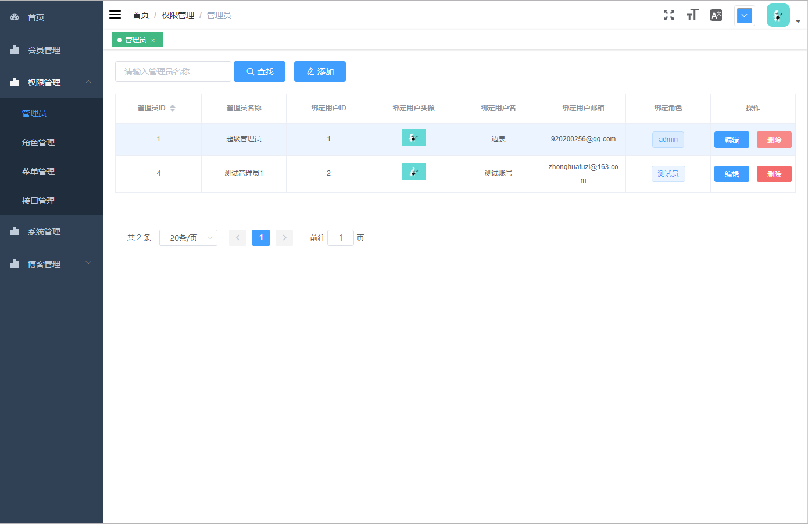
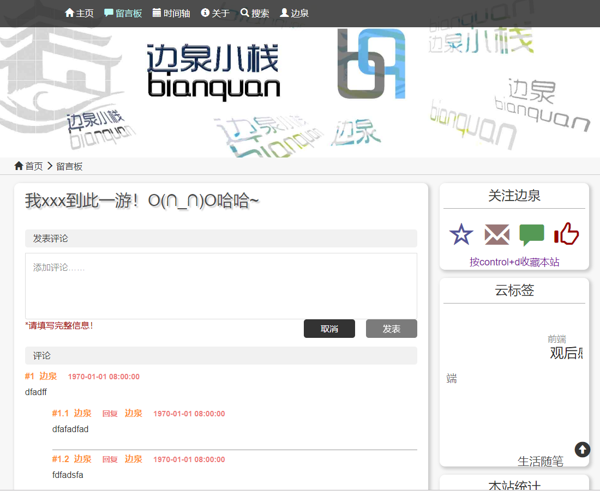
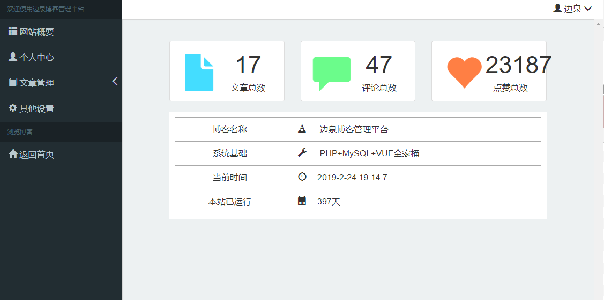

# TVcms

一个基于thinkPHP5+Vue2.5的简单cms内容管理程序


* 简单说明：本项目由原个人初学时开发博客重构而来，参考项请查看下方致谢

* 概要：提供动态权限控制、api自动注入、前端路由动态生成的管理平台

* [文档](https://gitee.com/zhuyunlong2018/TVcms/wikis/pages)（有空会陆续更新）

 

## 演示

说明：演示只是最为基础版本、且存在异常和bug，有兴趣最好可以直接clone到本地部署查看

* [admin](http://zhuzu.top/admin)
* [blog](http://zhuzu.top)


## 项目代码

* [码云](https://gitee.com/zhuyunlong2018/TVcms)
* [GitHub](https://github.com/920200256/TVcms)

## 项目架构
    

## 使用技术栈

> 1. thinkPHP5.0
> 2. Vue2.5
> 

## 本机环境
* PHP 7.2
* mysql 5.7
* node 8.11
* composer 1.6.5
* redis 3.2

## 项目启动

1. 下载代码

    打开命令行，输入以下命令
    ```bash
    git clone https://gitee.com/zhuyunlong2018/TVcms.git
    cd TVcms
    ```
    
2. 配置数据库：
    * 后端数据库参考TP5填写参数
    * 将servers/application下的copy_config.php和copy_database.php重命名为config.php和database.php
    * 将TVcms.sql文件导入自己的数据库中


3. 配置后台

    ```bash
    cd servers
    composer install
    ```
    
4. 配置前端

    命令行返回项目根目录
	admin管理后台模块，修改admin/config/文件夹下的dep.env.js、dev.env.js、prod.env.js中BASE_API修改为自己的地址
    ```bash
	cd admin
    npm install//安装不成功可以用cnpm install
    npm run dev
    ```
    blog模块相同,修改blog//config/文件夹下的dev.env.js、prod.env.js中BASE_API修改为自己的地址
	```bash
	cd blog
    npm install//安装不成功可以用cnpm install
    npm run dev
	```
    
5. 说明
   
   后端tp5的file类型cache实现容易有bug，即将使用redis更好，请确保安装PHP-redis扩展及redis服务端

## 注意事项

正式版了了无期，本版本未来一段时间将会发生较大变更，主要有以下几点：

* 后台缓存或将全面使用redis
* 后端权限验证代码、前端后台管理的权限页面将有较大改动
* 即将加入定时任务、完善api自动注入功能
* 即将加入对象存储管理列表

## 版本更新

目前一直为dev版，细节及功能都还待修改丰富中……


## 相关截图

管理总后台（cms)
   

原博客项目前台
   

原博客项目后台
   

## 致谢

本项目的admin前端模块基于或参考以下项目：
> 1. [vue-element-admin](https://github.com/PanJiaChen/vue-element-admin)
> 一个基于Vue和Element的后台集成方案
> 
> 2. [litemall](https://github.com/linlinjava/litemall)
>一个基于springboot+vue的前后端分离商城项目
>


## 原博客站引用

> 1. [Vue-SimpleMDE](https://github.com/F-loat/vue-simplemde)
>一个Markdown编辑器
>
> 2. [PHP-JWT](https://packagist.org/packages/firebase/php-jwt)
>登录token验证插件
